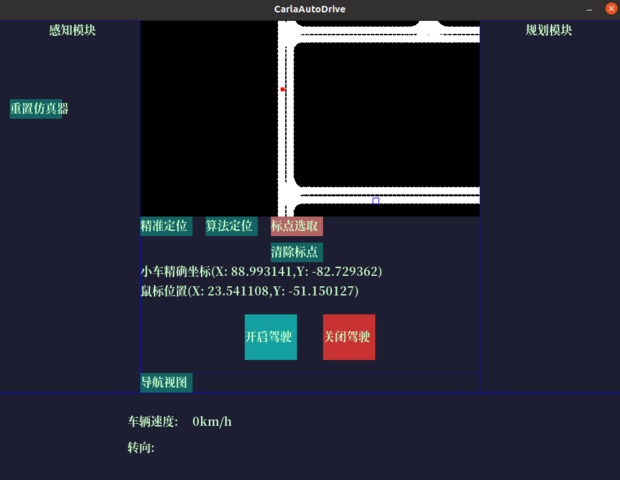
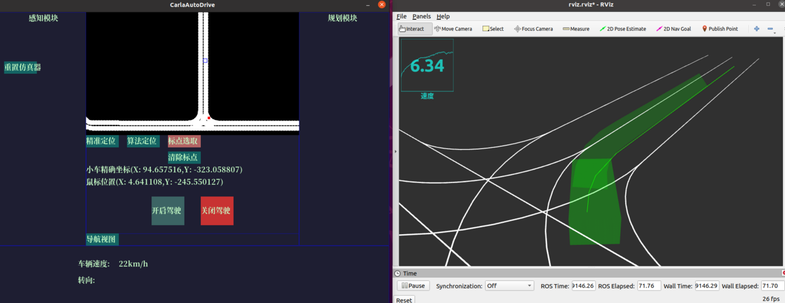

# CarlaAutoDrive
### 本项目是作者大学暑假期间闲来无事写的，如果大家有兴趣可以加入qq群一起讨论1007235968
#### 作者马上大三，菜鸡一个，第一次开始写开源项目做的很垃，希望可以得到大神指点^_^
#### PS:项目结构基于ros-noetic,同时需要提前安装0.9.12版本的carla模拟器以及兼容版本的carla_ros_bridge,其他版本的carla不清楚是否支持因为某些carla的API发生了变动可能导致程序报错。

### 项目结构
CarlaAutoDrive  
|-README.md  
|-src  
|&emsp;|-study  
|&emsp;|&emsp;|-c++  
|&emsp;|&emsp;|&emsp;|-include  
|&emsp;|&emsp;|&emsp;|-src  
|&emsp;|&emsp;|&emsp;|-pybind11  
|&emsp;|&emsp;|&emsp;|-CMakeLists.txt__|  
|&emsp;|&emsp;|-launch  
|&emsp;|&emsp;|&emsp;|-start.launch__|................................(ROS启动文件)  
|&emsp;|&emsp;|-rviz  
|&emsp;|&emsp;|&emsp;|-rviz.rviz__|................................(rviz可视化文件)  
|&emsp;|&emsp;|-scripts  
|&emsp;|&emsp;|&emsp;|-c++windows.py..............(负责控制台的操作和作为c++的python接口)  
|&emsp;|&emsp;|&emsp;|-draw_line.py............(负责rviz车道线可视化绘制)  
|&emsp;|&emsp;|&emsp;|-generate_map.py..............(负责生成地图信息并且绘制)  
|&emsp;|&emsp;|&emsp;|-global_plan.py__|.....................(作为全局规划器)  
|&emsp;|&emsp;|-CMakeLists.txt  
|&emsp;|&emsp;|-package.xml  
|&emsp;|-CMakeLists.txt  
### 安装方法

克隆项目后，首先进入c++目录  
`cd CarlaAutoDrive/src/study/c++`  
创建build文件夹  
`mkdir build`  
进入build文件夹  
`cd build`  
然后先执行`cmake..`  
再进行编译  
`make`  
等待编译成功后回退到项目主目录  
`cd ~/CarlaAutoDrive`  
再次进行ROS的编译  
`catkin_make`  
这个时候整个项目已经配置好了  

### 启动项目
首先可以启动你的carla模拟器  
`./CarlaUE4.sh`  
加载页面成功后可以启动你的carla_ros_bridge  
`roslaunch carla_ros_bridge carla_ros_bridge_with_example_ego_vehicle.launch`  
之后进入项目文件  
刷新环境变量  
`source ./devel/setup.bash`  
启动项目的launch文件  
`roslaunch study start.launch`  
如果显示出了一个蓝色的可视化窗口，那么项目就启动成功了  
  
点击**导航视图**会显示地图信息以及其他按键，可以拖动地图  
  
点击一次**精准定位**会让视角移动到小车位置并且锁定视角跟随小车移动，再次点击解除锁定  
点击**标点选取**后按钮会变色表示选中，此时点击地图上的某点会显示蓝色方框作为目标点，小车会自动规划全局路径和局部路径，点击**开始行驶**小车开始移动  
可以进入rviz文件夹并启动rviz可视化  
`rviz -d rviz.rviz`  
效果如图  
  
